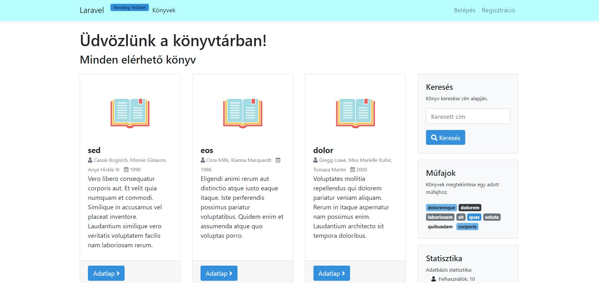
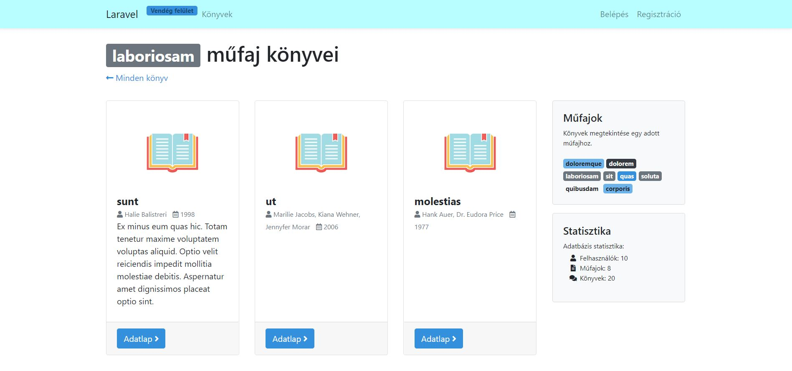
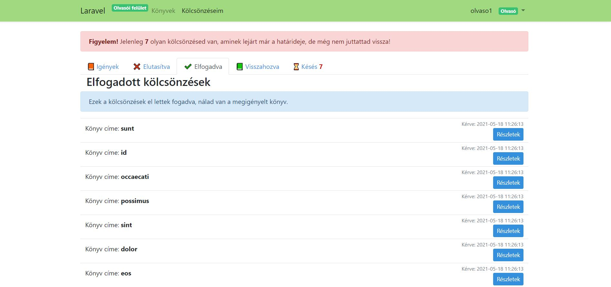
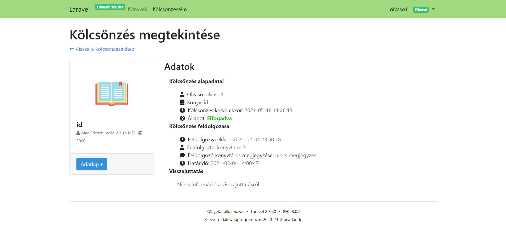
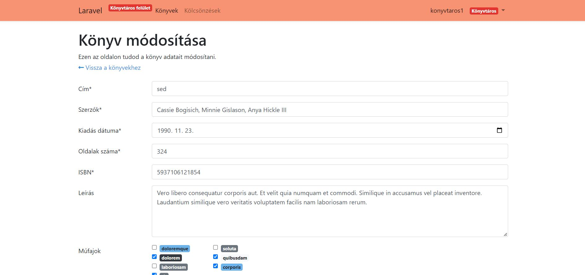
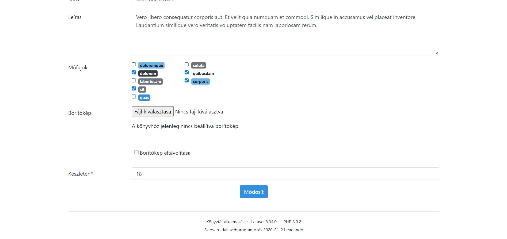
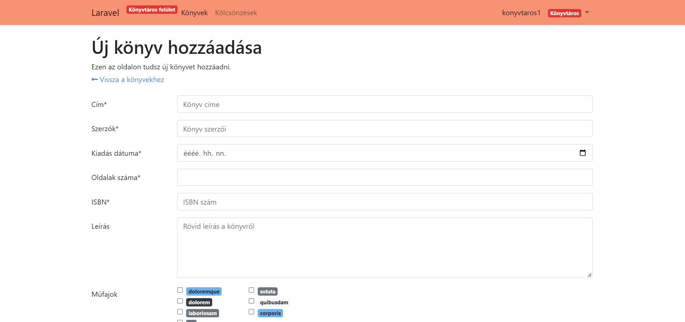
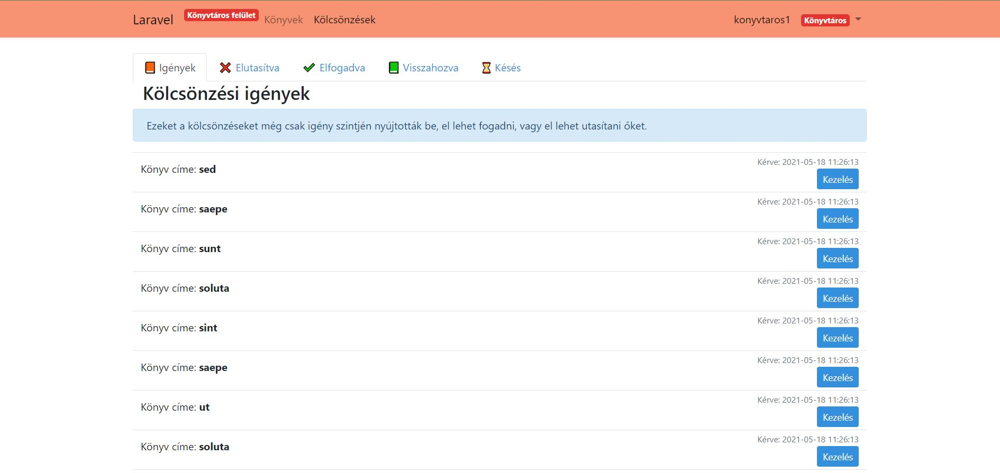
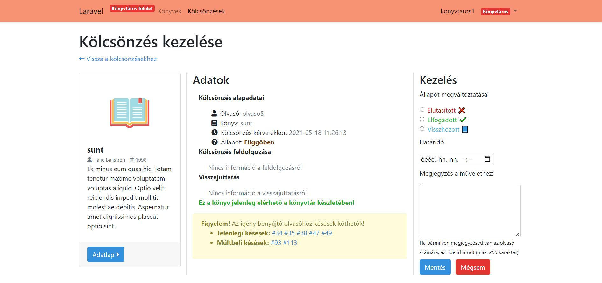
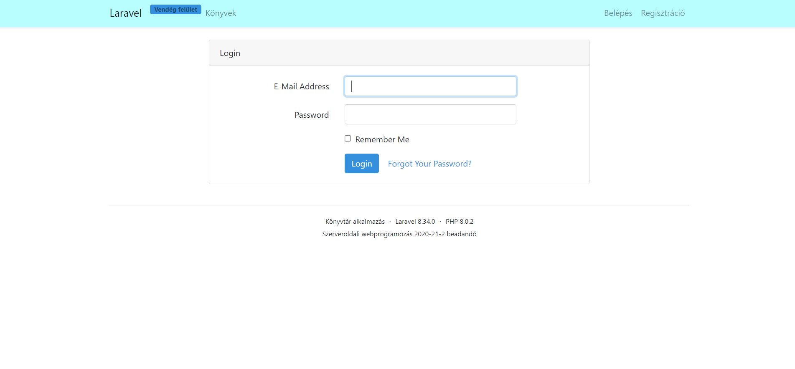

# Library

This Laravel webapplication is an imagenary library where you can borrow books.
This is a past uni assignment and filled with fake data. 

There are three types of users: guest, reader, librarian.

## Guest

As a guest you can see the available books in the library, the genres, the details of the books are visible. however you are not allowed to borrow them. 

## Reader

As a reader you can borrow books and see the status of your requests. 

## Librarian

As a librarian you manage the requests and upload books or modify them, add them to genres or add a new genre.

## Registration and login

To become a reader you have to register and login.

